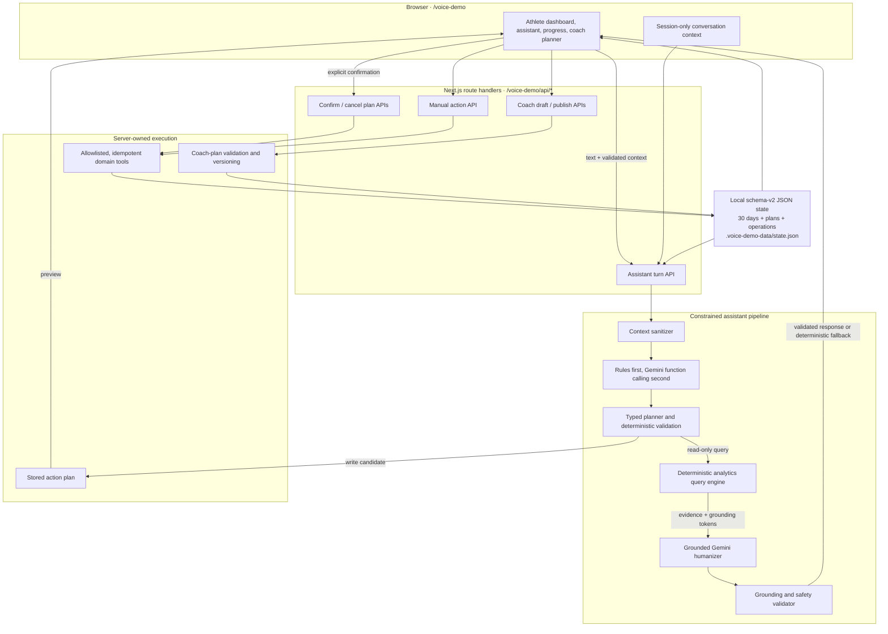

# Sports Coaching Platform

A multi-role web application for academies to manage athletes, training, attendance, wellness, recovery, performance, and coach ↔ athlete communication.

> **Core rule:** A coach only sees data for athletes assigned to that coach. Enforced in three layers (JWT → scope loader → route guard).

## Roles

- **coach** — sees only their assigned athletes
- **athlete** — sees only their own data
- **guardian** — sees only their linked athlete(s)

## Tech stack

- **Frontend:** Next.js 14 (App Router) + TypeScript + Tailwind CSS
- **Backend:** Node.js + Express + TypeScript
- **Database:** MongoDB via Mongoose (Atlas in production, local or `mongodb-memory-server` in tests)
- **Auth:** JWT (httpOnly access + rotating refresh cookies) with bcrypt password hashing and per-IP login rate limiting

## Repository layout

```
sports-coaching-platform/
├── apps/
│   └── web/                        # Next.js frontend
│       └── app/
│           ├── page.tsx            # Landing + sign-in (routes by role)
│           ├── coach/dashboard/    # Coach workspace
│           └── athlete/dashboard/  # Athlete workspace (mobile-first)
├── server/
│   └── src/
│       ├── models/                 # 13 Mongoose models
│       ├── routes/
│       │   ├── auth.ts             # /api/auth/*
│       │   ├── coach.ts            # /api/coach/*
│       │   └── athlete.ts          # /api/athlete/*
│       ├── middleware/             # auth, role, coachAthleteAccess
│       ├── services/dashboard.ts   # daily-card aggregator
│       ├── lib/tokens.ts           # access + refresh JWT helpers
│       └── scripts/seed.ts         # seed demo academy with realistic data
├── docs/
├── skills/sports-coaching-platform-builder/   # Full blueprint & build skill
└── package.json                    # npm workspaces root
```

## Apex Assist demo architecture

`/voice-demo` is an isolated, synthetic product demo inside the Next.js web workspace. It does not use the production Express API, MongoDB collections, authentication, or real athlete data. Its purpose is to validate the athlete assistant, deterministic analytics, coach-plan workflow, and confirmation UX before production integration.



### Request flows

**Read-only analytics**

1. The browser sends the athlete's text plus small session-only context.
2. The server sanitizes that context against stored dates, metrics, plans, and exercises.
3. Deterministic rules handle common prompts; Gemini function calling handles flexible language and may only select an allowlisted typed query.
4. The server validates the query and calculates rankings, averages, trends, comparisons, and relationships from the stored 30-day history.
5. Gemini may make the response more conversational using immutable evidence tokens. A second validator rejects free numeric claims, unsupported metrics, causal language, diagnoses, or prescriptions and falls back to the deterministic answer.
6. Read-only questions return evidence without creating an action plan or changing athlete data.

**Write actions**

1. Text or manual input is mapped to an allowlisted tool such as `add_water`, `record_wellness`, `update_training_session`, `record_recovery`, or `send_coach_message`.
2. The planner rejects unknown fields, invalid ranges, ambiguous sessions, and unsupported recipients. It never fills an unstated wellness value.
3. Assistant writes are saved as short-lived server-owned plans and shown as a preview.
4. Only the plan ID is sent back for confirmation; Gemini never receives database authority and never executes a tool.
5. The deterministic executor applies the confirmed operation once. Stable operation IDs make retries idempotent.
6. State is written through a serialized queue using a temporary file plus atomic rename, then the dashboard refreshes.

### Main layers

| Layer | Responsibility | Primary code |
|---|---|---|
| UI | Responsive athlete dashboard, scrollable assistant, fixed composer, progress view, coach planner, test laboratory | [`apps/web/components/voice-demo/`](apps/web/components/voice-demo/) |
| API boundary | Validates HTTP requests and keeps keys and provider calls server-side | [`apps/web/app/voice-demo/api/`](apps/web/app/voice-demo/api/) |
| Interpreter | Uses deterministic fast paths first and Gemini function calling for flexible language | [`assistantInterpreter.ts`](apps/web/lib/voice-demo/assistantInterpreter.ts) |
| Planner and policy | Resolves sessions, coach plans, dates, fields, permissions, clarifications, and previews | [`assistantPlanner.ts`](apps/web/lib/voice-demo/assistantPlanner.ts) |
| Analytics | Validates typed queries and calculates every numeric insight from recorded data | [`analyticsQuery.ts`](apps/web/lib/voice-demo/analyticsQuery.ts), [`analytics.ts`](apps/web/lib/voice-demo/analytics.ts) |
| Response grounding | Lets Gemini improve phrasing, then rejects unsupported claims and uses the deterministic fallback | [`assistantHumanizer.ts`](apps/web/lib/voice-demo/assistantHumanizer.ts) |
| Tool execution | Performs only allowlisted, range-validated, idempotent domain updates | [`tools.ts`](apps/web/lib/voice-demo/tools.ts) |
| Persistence | Seeds, versions, serializes, atomically writes, resets, and retrieves local demo state | [`store.ts`](apps/web/lib/voice-demo/store.ts), [`seed.ts`](apps/web/lib/voice-demo/seed.ts) |
| Coach planning | Maintains private drafts, validates exercise prescriptions, and publishes visible versions | [`coachPlans.ts`](apps/web/lib/voice-demo/coachPlans.ts) |

### Reliability boundaries

- Gemini interprets language and optionally rewrites grounded prose; deterministic TypeScript owns identity, dates, calculations, validation, permissions, and execution.
- Unknown tool arguments and unsupported analytics metrics are rejected.
- Conversation memory contains validated references only, remains in browser memory, and is cleared by refresh or demo reset.
- Read-only questions cannot create plans or operations.
- Every assistant write requires a visible confirmation; repeat confirmation cannot repeat the domain action.
- Training intensity is reported from Coach Priya's published plan. The assistant cannot prescribe or increase it.
- `GOOGLE_API_KEY` and `GEMINI_MODEL` are read only on the server. `DEEP_GRAM` is reserved for the later push-to-talk phase and is not used by the current text workflow.

This is intentionally a demo architecture. File-backed state, authentication-free routes, and the in-process write queue must be replaced by authenticated domain services, production persistence, shared idempotency, auditing, and durable notification handling before integration with real athlete data. See [the detailed demo notes](docs/voice-demo-30-day-analytics.md).

## Prerequisites

- Node.js 20+
- npm 10+
- A MongoDB cluster (local or Atlas — Atlas requires the running IP to be on the cluster's IP allowlist)

## Getting started

```bash
# 1. Install all workspaces
npm install

# 2. Copy env templates
cp .env.example .env
cp .env.example server/.env
cp apps/web/.env.example apps/web/.env.local

# 3. Seed the database (creates a demo academy with users, athletes, sessions, etc.)
npm run seed --workspace server

# 4. Run web + server in parallel
npm run dev
```

By default:
- Web: <http://localhost:3000>
- API: <http://localhost:4000>
- Health check: <http://localhost:4000/api/health>

## Scripts

| Command | What it does |
|---|---|
| `npm run dev` | Run web + server in parallel |
| `npm run dev:web` | Next.js dev server |
| `npm run dev:server` | Express dev server with ts-node-dev |
| `npm run build` | Build both web and server |
| `npm test --workspace server` | Run Jest suite (uses `mongodb-memory-server`, no external Mongo needed) |
| `npm run seed --workspace server` | Populate the connected database with demo data |

## Demo accounts (after seeding)

| Role | Email | Password | Lands on |
|---|---|---|---|
| Coach (3 athletes) | `coach.kumar@acme.test` | `Coach@123` | `/coach/dashboard` |
| Coach (1 athlete) | `coach.singh@acme.test` | `Coach@123` | `/coach/dashboard` (only sees Diya) |
| Athlete | `athlete.arjun@acme.test` | `Athlete@123` | `/athlete/dashboard` |
| Athlete | `athlete.bala@acme.test` | `Athlete@123` | `/athlete/dashboard` |
| Athlete | `athlete.chetan@acme.test` | `Athlete@123` | `/athlete/dashboard` |
| Athlete | `athlete.diya@acme.test` | `Athlete@123` | `/athlete/dashboard` |
| Guardian | `parent.rao@acme.test` | `Guardian@123` | `/guardian/dashboard` |

**Adding real users (coach-led onboarding):** beyond the seed, new users are provisioned in-app:
- An **academy owner** (a coach with `isAcademyOwner: true` — seeded as Coach Kumar) adds other **coaches** from `/coach/coaches`.
- Each **coach** adds their **athletes** (account + profile + roster assignment) and **guardians** (account + link) from `/coach/athletes/new`.
- Every created account gets a one-time temp password to hand over, and is nudged to set their own password on first sign-in (`/account`).

This is the deliberately role-scoped replacement for the removed admin provisioning — a coach can only create `athlete`/`guardian` accounts (and an owner additionally `coach` accounts) in their own academy. New coaches are not owners.

## Implemented features

### Auth (✅ shipped)

- `POST /api/auth/login` — bcrypt-verified login; returns `accessToken` and sets HttpOnly `accessToken` + `refreshToken` cookies (refresh scoped to `/api/auth`, `SameSite=Lax`, `Secure` in production)
- `POST /api/auth/refresh` — rotates the refresh token, issues a new access token
- `GET /api/auth/me` — returns the authenticated user
- `POST /api/auth/logout` — clears cookies and unsets `User.refreshTokenHash`
- Per-IP rate limit: **5 login attempts per 60 s** → `429 too_many_login_attempts`
- Security headers on every response: `X-Content-Type-Options`, `X-Frame-Options`, `Referrer-Policy`, `Permissions-Policy`
- Mongo connection string is redacted in logs
- **Web client is cookie-only**: the access token is never stored in JS-readable storage (no XSS exposure); the shared `apiFetch` helper ([apps/web/lib/api.ts](apps/web/lib/api.ts)) sends the httpOnly cookie and transparently refreshes on a 401

### Coach workspace (✅ shipped)

- `GET /api/coach/athletes` — coach's assigned roster only
- `POST /api/coach/athletes` — **coach-led onboarding**: creates a new athlete (`User` + `AthleteProfile`) and assigns them to the coach; returns a one-time temp password
- `POST /api/coach/athletes/:athleteId/guardians` — adds a guardian for an assigned athlete (`User` + `GuardianAthleteLink`); reuses an existing guardian account if the email already belongs to one; returns a temp password for new guardians
- `GET/POST /api/coach/coaches` — **academy owner only** (a coach with `User.isAcademyOwner`): list / create coaches in the owner's academy (create returns a temp password). Non-owner coaches get `403 forbidden_not_owner`. This is a scoped provisioning capability, **not** a revived admin role.
- `GET /api/coach/dashboard?date=YYYY-MM-DD` — daily cards for each assigned athlete
- `GET /api/coach/athletes/:athleteId/daily-card?date=` — single athlete card
- `POST /api/coach/athletes/:athleteId/comment` — coach feedback visible to the athlete
- `GET /api/coach/athletes/:athleteId/rpe-monitoring?date=` — assigned athlete's AM/PM RPE
- `POST /api/coach/athletes/:athleteId/attendance` — coach records attendance (upsert/day)
- `POST /api/coach/athletes/:athleteId/training/:slot` — coach sets the plan (type/plan/intensity/status)
- `POST /api/coach/athletes/:athleteId/performance` — coach logs a performance entry
- `GET /api/coach/athletes/:athleteId/performance?metric=&limit=` — performance history
- `GET /api/coach/athletes/:athleteId/trends?days=7` — per-day readiness / load series for a sparkline
- `GET /api/coach/athletes/:athleteId/activity?limit=40` — merged recent-activity timeline
- All single-athlete routes run `requireAthleteAccess`, so a coach can only read/write assigned athletes
- **UI at `/coach/dashboard`**: KPI strip (assigned / present / sessions completed / avg readiness), per-athlete card showing attendance, AM/PM session, readiness, soreness, recovery, injury, RPE risk — plus an inline **feedback composer** that posts a coach comment

### Guardian workspace (✅ shipped)

Role-gated `guardian`, read-only, scoped to linked athletes (`GuardianAthleteLink`):

- `GET /api/guardian/athletes` — linked-athlete roster (summary only)
- `GET /api/guardian/athletes/:athleteId/daily-card?date=` — read-only daily summary
- `GET /api/guardian/athletes/:athleteId/coach-comments?date=` — coach feedback for a linked athlete
- `GET /api/guardian/athletes/:athleteId/trends?days=7` — read-only per-day trend series
- `GET /api/guardian/athletes/:athleteId/activity?limit=40` — read-only recent-activity timeline
- Access to a non-linked athlete returns `403 not_linked_guardian`; guardians have no write endpoints
- **UI at `/guardian/dashboard`**: linked-athlete picker, read-only daily card (attendance / readiness / sessions / recovery / injury / RPE risk), and coach feedback

### Athlete workspace (✅ shipped — Phase A)

Mobile-first single-column dashboard at **`/athlete/dashboard`**:

1. Today's Schedule (AM/PM session, injury restriction)
2. Daily Check-in (sleep, sleep quality, mood, stress, soreness, fatigue) → readiness score
3. Attendance (Present / Late / Absent)
4. Training Completion per slot (Completed / Partial / Missed)
5. Recovery Tracking (Stretching, Ice bath, Mobility, Physio, Hydration)
6. Notes to Coach
7. Coach Feedback (read-only)

Backed by `/api/athlete/*` — every endpoint scopes writes to the caller's own `athleteProfileId`; client-supplied `athleteId` is ignored. Athlete writes propagate to the coach dashboard on next refresh.

| Endpoint | Purpose |
|---|---|
| `GET /api/athlete/me` | Own profile |
| `GET /api/athlete/daily?date=` | Own daily card (same shape as coach card) |
| `POST /api/athlete/wellness` | Upsert daily check-in |
| `POST /api/athlete/attendance` | Upsert attendance |
| `POST /api/athlete/training/:slot` | Update AM/PM session status |
| `POST /api/athlete/recovery` | Upsert recovery modalities |
| `POST /api/athlete/notes` | Append a note to coach |
| `GET /api/athlete/notes?date=` | Own notes for the day |
| `GET /api/athlete/coach-comments?date=` | Coach feedback for the day |
| `GET /api/athlete/trends?days=7` | Trailing per-day readiness / load / sleep / recovery series |
| `GET /api/athlete/activity?limit=40` | Merged recent-activity timeline (sessions, RPE, check-ins, comments…) |

### Health

- `GET /api/health` → `{ status: "ok", env }`

## RBAC enforcement (three layers)

1. **`requireAuth`** ([middleware/auth.ts](server/src/middleware/auth.ts)) — verifies the access token from `Authorization: Bearer` or the `accessToken` cookie, re-reads the user from Mongo, sets `req.actor = { userId, role }`.
2. **`loadScope`** ([middleware/coachAthleteAccess.ts](server/src/middleware/coachAthleteAccess.ts)) — populates `assignedAthleteIds` (coach), `linkedAthleteIds` (guardian), `athleteProfileId` (athlete), `academyId`.
3. **`requireRole(...)`** + **`requireAthleteAccess(param)`** — gate every scope-sensitive router and verify per-athlete access.

The athlete router additionally never accepts a client-supplied athlete id — every write goes to `req.actor.athleteProfileId` only.

## Data model

15 Mongoose models in [server/src/models/](server/src/models/):

`User`, `Academy`, `AthleteProfile`, `CoachAthleteAssignment`, `GuardianAthleteLink`, `Attendance`, `TrainingSession`, `Wellness`, `Recovery`, `Performance`, `Injury`, `AthleteNote`, `CoachComment`, `RpeMonitoring`, `AuditLog`.

Daily collections (`Attendance`, `Wellness`, `Recovery`, `TrainingSession`) have a unique compound index keyed by `(athleteId, date[, slot])`, so the athlete & coach endpoints simply upsert — "edit today's entry" is the same code path as "create today's entry."

## Tests

```bash
npm test --workspace server
```

Current count: **131 tests across 13 suites**, all passing — covering auth, the RBAC matrix, coach dashboard aggregation, the full athlete workspace (incl. wellness range validation, write rate-limiting, and cross-athlete isolation), RPE monitoring/readiness, coach write endpoints (attendance/training/performance), the guardian read API (linked-athlete isolation), the trends API (per-day readiness/load series + scope), the activity feed (merge/sort/scope), and coach-led onboarding (athlete/guardian account creation, temp-password login, duplicate/guardian-reuse handling, and cross-coach isolation).

## Current status

**Shipped:**
- Auth (login / refresh / logout / me, rate-limited, security headers, cookie-only web client)
- All three role workspaces with UI: **coach** (`/coach/dashboard`), **athlete** (`/athlete/dashboard`), **guardian** (`/guardian/dashboard`)
- Coach: dashboard + RPE view + write endpoints (comment / attendance / training plan / performance) with an inline feedback composer
- Athlete: daily workflow (check-in / attendance / training / recovery / notes ↔ coach) with input range validation + write rate-limiting
- Athlete RPE Monitoring — `RpeMonitoring` model with computed training load, risk flag + reasons, and readiness score; surfaced on the coach dashboard
- Guardian read API + UI (`/api/guardian/*`) — read-only linked-athlete roster, daily card, and coach comments
- Trends API + UI (`/api/*/trends`) — trailing per-day readiness/load/sleep series rendered as dependency-free SVG sparklines on the athlete, coach, and guardian views
- Activity API + UI (`/api/*/activity`) — merged, time-sorted timeline of sessions/RPE/check-ins/recovery/comments/notes/performance/injuries on the athlete and guardian views
- Premium **light** sports-performance UI: clean off-white backgrounds, white cards, lime accents, readiness rings, status chips, risk-sorted coach cockpit, condensed athletic type (token-driven theme in [apps/web/app/globals.css](apps/web/app/globals.css))
- 131/131 server tests passing; web app typechecks and production-builds clean

**Up next:**
- Sport-specific performance entry (athletics / badminton / etc.) driven by a shared metric catalog
- Coach UI forms for attendance/training-plan/performance (APIs shipped; only the comment composer is wired so far)

## Project blueprint

See [skills/sports-coaching-platform-builder/](skills/sports-coaching-platform-builder/) for the full architecture, database schema, RBAC matrix, API contract, UI flow, and step-by-step implementation plan.

Production deployments must provide non-placeholder `JWT_ACCESS_SECRET`, `JWT_REFRESH_SECRET`, and `MONGODB_URI`.
